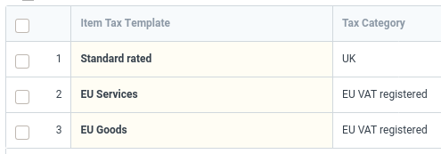
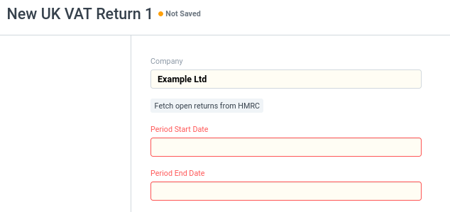
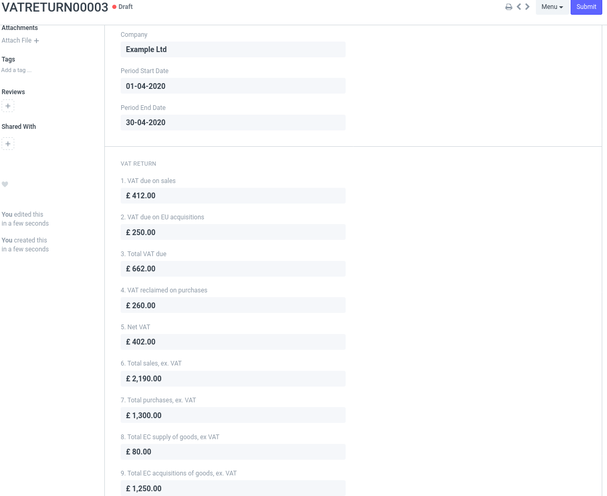
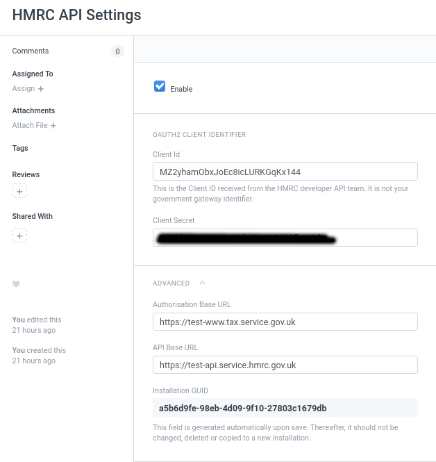
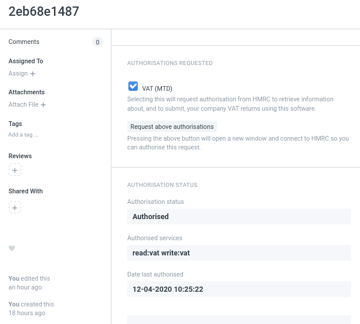

# UK VAT Module

The UK VAT module is an application for ERPNext to extend it to include:

 * A VAT Return generator for UK/EU VAT. This uses data from your invoices to automatically
   produce a VAT return;

 * A drilldown report to show the underlying composition of the VAT return; and

 * An optional Making-Tax-Digital submission. (Please note: This feature requires additional
   client credentials from HMRC.)

We hope you find it useful. Please feel free to raise issues or submit pull requests as
required.

## Installation

You can install this module into your existing installation with :

```sh
	bench get-app uk_vat https://github.com/software-to-hardware/erpnext-vat-mtd
	bench install-app uk_vat
```

## Configuration of the VAT return

### Overview

The VAT return derives its information from the line items in each invoice, both purchases
and sales.

The line items are linked to "Item Tax Templates" which describe how the VAT return should
process each line item.

Finally, the "Item Tax Templates" can be chosen dynamically, depending on where your customer
is based by linking them to "Tax Categories."

You can use your own "Tax Categories" and "Item Tax Templates" or you can configure them
as described here. To provide maximum flexibility, the VAT Return uses only the
additional data attached to the "Item Tax Templates" and does not rely on fixed
naming or configuration.

### Defining Tax Categories

The "Tax Categories" are applied to customers and suppliers to determine which overall tax
rules to apply to that entity.

For our example installation, we shall refer to three categories:

 * UK
 * EU VAT registered
 * RoW (Rest of World)
 
These categories are not fixed. You are free to define additional categories to suit your
needs.

Define the tax categories in the "Tax Category List." You can get this by searching for it
in the search box at the top of the screen.

### Defining the "Tax Item Templates"

The Tax Item Templates are used to describe the tax rules that apply to individual invoice
line items.

Example Tax Item Templates are:

 * Standard rated
 * Lower rate
 * Exempt
 * Zero Rated
 * VAT does not apply
 * EU Goods
 * EU Services
 * EU Goods (Zero rated)

When you install UK VAT, the "Tax Item Template" is extended so it can hold additional
information describing the rules for your VAT return. An example of this is shown here:


The "Tax Rates" section at the top defines which ledger accounts this
transaction should affect.

The fields in the "VAT Details" section at the bottom define which boxes on
the VAT return will be affected.

You are free to define the categories as you see fit or use existing categories
if you have them

### Applying the Tax Item Templates

The tax item templates are linked to your invoice items by using Item Groups. Using item
groups allows you to apply the Tax Item Templates to a group of items without needing to
visit each one. However, if you need to specialise an item, you can apply a Tax Item Template
directly to it if you wish.

For example, our "services" item group may define the following links:



Note that both EU Service and Goods are defined. The order defines which one is
chosen by default. Having both allows the invoice line items to be customised at the
time the invoice is made to use either. This is required because if service
delivery is a component of goods delivery then for VAT purposes it may need to
be counted as goods for the purposes of the VAT return.

## Generating a VAT return

A VAT return can be generated by searching for "New UK VAT Return" from the search bar.



After selecting your company, if you have configured MTD (described later in
this document) you can press the "Fetch open return from HMRC" button to select
dates of outstanding VAT returns. 


Otherwise enter the dates manually and save the document to generate the return.



### VAT return drilldown

To understand how the VAT return is made up, a drilldown report is provided. You
can either access this directly, or by pressing the "Show drilldown" button at the
top of a VAT return.


The report shows each box on the VAT return and then, underneath, which invoice
line-items were used to make up that figure.

## Submitting VAT returns to HMRC

The UK VAT module provides the ability to submit a VAT return electronically to HMRC using
their Making-Tax-Digital (MTD) internet service.

To use this facility an MTD Client Identifier and Secret are required. These are provided
to you by HMRC and are additional to your government gateway id.

The general steps to get this to work are :

 * Setting up the API
 * Authorising your ERPNext installation to access VAT data
 * Submitting your returns

### Setting up the API

To use the electronic submission facility, the API must be enabled and the
Client ID and secret must be entered. You do this by searching for the "HMRC API Settings"
page, selecting "Enable" and entering the required values.



If you wish to test the submission facility against HMRCs test servers, you can change
the endpoints under the "Advanced" view at the bottom of the page.

### Authorising your ERPNext to access your VAT data

The next step is to obtain an authorisation from HMRC to allow ERPNext to submit VAT returns.
This is acheived electronically, as follows.

1) Go to the HMRC AUhtorisations List. (search for it.)

2) Create a new authorisation, select your company and save the document.

3) Select the "Request above authorisations" option. This will open a new pop-up window
   (you may need to allow this). Follow the on-screen instructions from HMRC.

When complete, you will be returned to the authorisation document and it should look like
this:



This authorisation is valid (at the time of writing) for 18 months after which you will
need to repeat this step (by pressing the Request above authorisations button) again.

### Submitting your VAT returns

Your VAT return can now be submitted using the button at the bottom of the VAT return page.


## License

GNU/General Public License (see [license.txt](license.txt))

